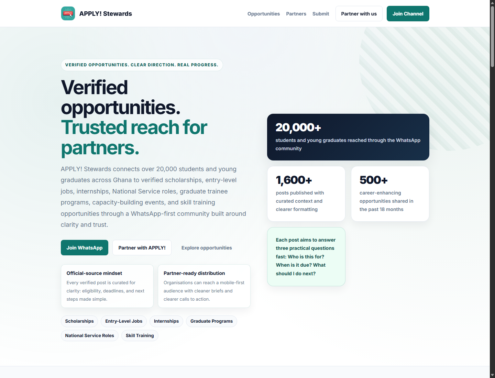

# APPLY! Stewards

APPLY! Stewards is a WhatsApp-first opportunity platform for students, NSS personnel, recent graduates, and early-career talent in Ghana. The site acts as the public trust layer for a community that distributes verified opportunities and gives partners a clear route to reach the right audience.



## What this project does

- Presents APPLY! Stewards as a trusted opportunity distribution brand.
- Shows one featured verified opportunity on the homepage.
- Separates verified opportunities from member-advertised listings.
- Provides public submission and partnership pages.
- Includes an internal ops workflow for reviewing, saving, publishing, and featuring opportunities.
- Uses Netlify Functions and Netlify Blobs for lightweight serverless operations.

## Pages

- `/` - public homepage with trust signals, partner CTA, WhatsApp CTA, and featured opportunity.
- `/opportunities.html` - opportunity hub for verified and member-advertised listings.
- `/help-desk.html` - public coming-soon page for the APPLY! Opportunity Help Desk pilot.
- `/partners.html` - partnership page for recruiters, employers, training providers, and institutions.
- `/submit.html` - public opportunity submission form.
- `/ops.html` - protected internal workflow for APPLY! Stewards operators.
- `/desk.html` - protected publishing desk for WhatsApp-ready posts, reminders, LinkedIn copy, and branded post images.

## Serverless functions

The Netlify functions live in `netlify/functions` and support:

- featured opportunity reads
- member opportunity reads
- public opportunity submissions
- protected opportunity management
- protected publishing status management
- trusted source syncing
- scheduled featured opportunity rotation

Protected ops actions require `APPLY_ADMIN_TOKEN`.

## Tech stack

- HTML, CSS, and vanilla JavaScript
- Netlify Functions
- Netlify Blobs
- Node.js ES modules

## Local setup

```bash
npm ci
cp .env.example .env
npm run check:functions
```

To test the static pages locally, serve the project root with any static server.

```bash
npx serve .
```

## Deployment

This project is configured for Netlify with portable paths:

- publish directory: `.`
- functions directory: `netlify/functions`

Set `APPLY_ADMIN_TOKEN` in Netlify before using protected actions in `/ops.html` and `/desk.html`.

## Roadmap

- Keep improving the verified and member-advertised opportunity lanes.
- Add stronger partner reporting and listing packages.
- Pilot the Opportunity Help Desk for CV, cover letter, checklist, and deadline support.
- Expand source syncing for trusted official opportunity feeds.
- Add optional DM delivery for approved daily post packs.
- Explore a future paid planning and accountability tier powered by LockIn-style workflows, embedded into the APPLY! opportunity journey.

## Portfolio note

This repository showcases the public APPLY! Stewards website, serverless opportunity workflows, and the product direction for a WhatsApp-first youth opportunity platform.
